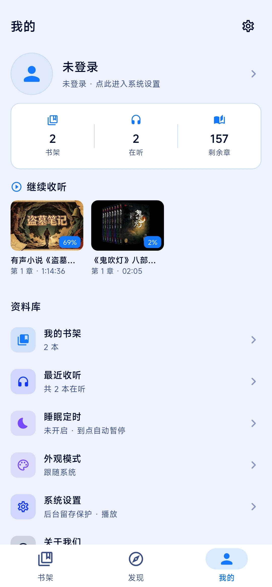
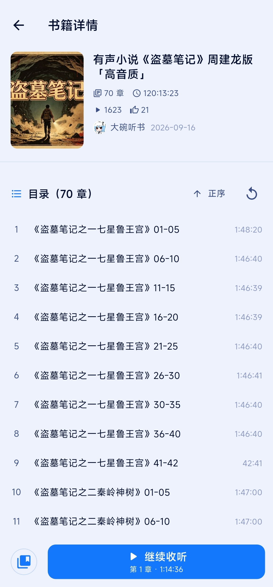
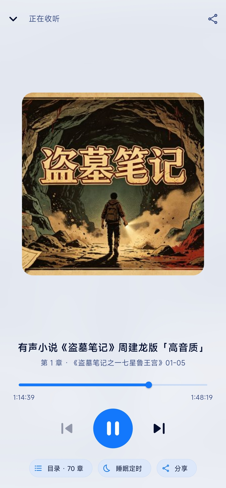

<div align="center">


# 阿B听书

**把有声小说装进一个专注「听」的播放器**

Flutter · Android · 无广告 · 永久免费 · 免登录可用

---

## 简介

阿B听书是一款基于 Flutter 的 Android 听书播放器：在发现页按分类/主播浏览有声内容，进入书籍详情后按「分P = 章节」连续播放，退出应用或锁屏后仍在通知栏/锁屏继续控制，并记住每一本书听到的具体秒数。

- 内容来自哔哩哔哩公开视频的音频轨道，应用本身不存储、不修改、不二次分发任何内容。
- 不做账号体系，未登录即可搜索与收听；扫码登录仅用于同步昵称头像并提升搜索稳定性。
- 本项目为个人学习作品，与哔哩哔哩官方无任何关联。

## 功能特性

**发现与搜索**
- 分类浏览：热门推荐 / 广播剧 / 评书 / 相声 / 悬疑 / 玄幻仙侠 / 名著悦读
- 精选主播：单田芳、刘兰芳、郭德纲、周建龙、紫襟、王明军、光合积木、729声工场 等，一点直达 TA 的作品
- 搜索自动限定在「有声小说」范围，过滤解说、漫推、短视频等无关内容
- 分类结果本地缓存，减少重复请求

**播放**
- 分P 即章节：自动连播、上/下一章、±15 秒快进快退
- 断点续播精确到秒（退到后台、切换章节、退出应用都会保存进度）
- 章节列表：标题自带序号时不重复编号；已听章节置灰；支持正序/倒序
- 睡眠定时：预设 10/15/30/45/60 分钟、2 小时，也可自定义 1~720 分钟
- 音频焦点：来电或其它应用播放时自动暂停，打断结束后自动续播；提示音只压低音量不打断
- 后台播放：前台服务 + 系统媒体会话，通知栏与锁屏可控制，暂停后通知不消失

**其它**
- 书架收藏、继续收听、最近收听（均显示精确进度）
- 扫码登录（二维码可保存到相册）
- 外观模式：跟随系统 / 浅色 / 深色
- 后台留存保护（电池优化豁免引导）
- 检查更新：一键比对 GitHub Releases，有新版本直接提示下载
- 分享原作品链接

## 截图

共 6 张，别错过完整使用流程：

| 书架（精确进度 / 继续收听） | 发现（分类 / 精选主播） | 我的（收藏 / 设置入口） |
| --- | --- | --- |
|  |  |  |
| 书籍详情（分P目录 / 已听置灰） | 播放（连播 / 睡眠定时入口） | 睡眠定时（自定义 1~720 分钟） |
|  |  |  |

## 下载

前往 [Releases](../../releases) 下载 APK，安装即可（Android 7.0+，已签名、包名 `dev.pages.abts`，安装包彼此可覆盖升级）。

| 安装包 | 体积 | 适用设备 |
| --- | --- | --- |
| `abts-v0.1.0-arm64-v8a.apk` | ~26 MB | **绝大多数手机都选它**（2017 年后的主流安卓机基本都是 arm64） |
| `abts-v0.1.0-armeabi-v7a.apk` | ~23 MB | 较老的 32 位手机 / 低端设备（armv7） |
| `abts-v0.1.0-x86_64.apk` | ~28 MB | x86_64 模拟器 / 平板 / 部分盒子 |
| `abts-v0.1.0-universal.apk` | ~73 MB | 不确定 CPU 架构时选它，一个包兼容所有架构（体积最大） |

> 怎么确认架构：设置 → 我的设备 → 处理器型号；或用 CPU-Z / AIDA64 查看 ABI 一栏。

## 从源码构建

```bash
# 环境：Flutter 3.38.x（Dart 3.10+）、JDK 17、Android SDK
flutter pub get
flutter build apk --release            # 通用包
flutter build apk --release --split-per-abi   # 按架构分包（体积更小）
# 产物：build/app/outputs/flutter-apk/
```

**签名说明**：若存在 `android/key.properties` 则用其中的证书签名，否则回退 debug 签名（便于他人直接构建）。配置格式：

```properties
storePassword=你的密码
keyPassword=你的密码
keyAlias=你的别名
storeFile=abitingshu.keystore   # 相对 android/app/ 目录
```

`key.properties`、`*.keystore`、`*.jks` 均已在 `.gitignore` 中，不会被提交。

## 项目结构

```
lib/
├── core/
│   ├── network/        # BiliClient（Cookie 预热 / WBI 签名 / 限速重试）、CookieJar、端点常量
│   ├── storage/        # 书架与收听进度（SharedPreferences 持久化）
│   ├── theme/          # 主题与配色（跟随系统 / 浅色 / 深色）
│   └── nav/            # 底部 Tab 全局切换
├── data/               # 分类与精选主播种子数据
├── models/             # Book / Chapter / AudioTrack
├── player/             # BookPlayer（连播、断点续播、睡眠定时、音频焦点）+ 系统媒体会话桥接
├── services/           # BiliApi 数据层、登录态、音频焦点、电池优化、相册保存
├── pages/              # 书架 / 发现 / 我的 / 详情 / 播放 / 登录 / 设置 / 睡眠定时 …
└── widgets/            # 迷你播放条、书籍卡片、封面 …
android/app/src/main/kotlin/dev/pages/abts/MainActivity.kt   # 音频焦点、电池优化、保存图片原生通道
tool/                  # 接口探针脚本（调试用，可独立 dart run）
```

## 实现要点

- **取流链路**：`search/type`（WBI 签名）→ `view`/`pagelist` 得到分P → `playurl`（`fnval=4048` DASH）→ 优先 AAC，flac/dolby 兜底，`http` 地址统一升级 `https`。
- **请求伪装**：携带 `buvid3`、预热 Cookie、合法 `Referer/Origin`、`platform=pc`、`web_location`，并做最小请求间隔与风控码重试。
- **音频焦点**：原生 `AudioManager` 申请/释放焦点，向 Dart 派发 `interrupted / ducked / lost / gained`，播放器据此暂停、闪避音量或自动续播。
- **进度持久化**：播放位置以独立 `ValueNotifier` 驱动进度条（避免整页重建），落库时读取实时位置，退到后台/退出前再补一次。

## 免责声明

1. 本应用为第三方个人开发的播放工具，与哔哩哔哩官方无任何关联，不代表、也不受哔哩哔哩官方授权或认可。
2. 应用内所有音频、封面、文字等内容均来自第三方平台的公开链接，版权归原作者及相关权利人所有。本应用不存储、不修改、不二次分发任何内容。
3. 内容仅供个人学习、研究与试听交流使用，请勿用于任何商业用途；请勿下载、录制或传播相关内容。
4. 请在试听后支持正版：如喜欢某部作品，建议前往官方平台购买、订阅或支持作者。
5. 若权利人认为本应用侵犯其合法权益，请告知开发者，我们将在核实后及时处理（包括但不限于移除相关入口）。
6. 因使用本应用产生的任何直接或间接后果，由使用者自行承担。

## 开源协议

[MIT](LICENSE)

## 致谢

参考与借鉴了以下开源项目的思路：PiliPlus、biu、bbplayer、bili-music、BiliPai 等。
